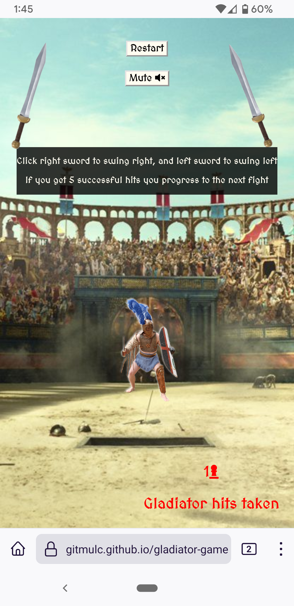

# Gladiator Game

The Gladiator Game is a game that utilises basic Javascript functions to illustrate and engage the user in a boolean or true/false type game. You are facing off against two gladiators in the Grand Colosseum in ancient Rome. You simply must strike left or right to hit the gladiator. It may be a block by the opposing gladiator or a hit. Your objective is to get 5 total hits on a gladiator to defeat them and win your freedom. The gladiator game is seeks to be responsive to the user, fun, replayable and easy to use. 

## User Stories

- As a user I want to play an easy to understand quick game. I want to easily play and enjoy replaying it.
- As a user I want to feel immersed in the game and have a clear distinction between winning and loosing. 

## UX

The design of the Gladiator game is meant to illustrate a battle between gladiators taking place in ancient Rome within the Grand Colosseum. This is to be accomplished with a combination of images, sound effects and ambient background sounds.

### Colour Scheme

A simple black and white colour scheme was selected as its vivid contrast was needed to illustrate text amoungst the many images on the site.

A simple black `rgba(0, 0, 0, 0.8)` colour was selected for texted backgrounds to highlight them.

A white colour that closely resembled marble was selected for text. It excellently illustrates text, and additionally the resemblance to marble adds to the theme of ancient Rome.

### Typography

The MedievalSharp was selected as the primary font to be used thorughout the site. Similarly to the marble white, it's old medieval aesthetic was meant to convey a theme of ancient Rome and a time long ago to really immerse the user in the game.

[MedievalSharp](https://fonts.google.com/specimen/MedievalSharp)

### Wireframes

## Features

### Existing Features

-__The User Interface__-
    - The game allows you to start the game with a single press of a button, and you can click either the left sword image or the right sword to play the gladiator game. 
    - Easy for user to grasp and understand. 
    - There is a fight button at the top to start the game. This is the most important feature as it starts the game. 
    - A restart button is used for replayability and can be pressed at anytime to start over. 
    - A mute and unmute button below the fight button to mute or unmute all music and sound effects. 
    - Two swords, one on the left and one on the right, are found and are the primary source of interaction between the user and the game. They must select one to swing left or right.
    - A text area with a black background is found all throughout the game for clarity for the user. This is to explain to the user what is going on. An image of one of the two      gladiators will also be on screen when the game/fight starts. 
    - Hit tallies are found on the bottom of the screen to show the user how many hits a gladiator and/or they have taken at any given moment. They are highlighted with red colours (for enemy gladiators) and green (for the hit tally to show how many hits the user has taken in the second gladiator fight).

-__Explanation Area__-
    - This is the area found in the center of the screen with white text aagainst a black background. It's purpose is to tell or inform the user how the game works and what they need to do. Additionally it shows if the user has won or lost the fight at the end of the boss fight.

-__Attack Buttons__-
    - Two swords will remain present on the left and right of the screen while the user is fighting. 
    - These are the primary means of interacting with the gladiator game, as they allow you to strike your opponent. 
    - Selecting one chooses the side that you strike the opposing gladiator.
    - These sword images are made to be as clear as possible to make attacking easier for the user.

-__Sound effects__-
    - A swing sound effect sounds whenever the user clicks on the swords to demonstrate a sword swing against their opponent. 
    - In the first fight, if the user clicks the correct side a gore sound effect will signify a hit against the gladiator. If a metal clang sound effect is heard, the opponent has blocked the attack. In the second fight a separate gore sound effect from the first one will sound to signify that the player has recieved damage. A loud cheer is played when the user defeats the first gladiator and progresses to the next gladiator. 
    - Furthermore, an ambient soundtrack plays in the background to help immerse and engage the user. The sound features were included to add more excitement and an additional level of interactivity.

-__Mute/Unmute__-
    - In response to adding a lot of sound features, a mute and unmute feature had to be added to the site so the user could easily tailor their experience. There is a mute and unmute button which toggles the sounds and music found on the site. They are found on the top of the site below the restart/fight button and are always available should the user want to turn off the sound at any time.

-__Enemy Image__-
    - Two images are found on the site, one of the first gladiator and the other of the second boss gladiator. These images are used to illustrate the enemy that the user will face in the game.

-__Health counter/tallies__-
    - Responsive tallies, that tells you the current hits landed on the gladiator you're facing, are found at the bottom of the screen at all times throughout the fight(s). They also serve to illustrate if an attack has hit the opponent or not, especially if the user has toggled the mute button. This is to indicate how close the user is to winning the gladiator game. In the second fight, there are two tallies. One for the user (in green) and one for the boss gladiator(in red). These colours were used as a means to highlight their importance to the user. Each fighter starts at 0 and when either the player or boss lands a hit, their respective tally will increment until one hits five. First one to hit 5 loses and the other is declared the winner. Each tally also has an icon. The pawn icon for the first gladiator, the crown for the boss gladiator, and the shielded figure for the player.

-__Restart__-
    - The restart button allows you to start over or replay at any point in the game. This features gives the user a form of replayability and it allows them to restart the game should they lose.

-__Hit/Block Messages__-
    - During the fight, hit or block messages will pop up in red text momentarily in the middle of the screen. The purpose of these features is to convey what is happening throughout the fight if the user has the mute button toggled.

### Features Left to Implement

- A hit counter that decrements a gladiator would be a better feature to implement on the boss gladiator. 

### Technologies

- JavaScript (JS) was the primary programming language for this project and was used to run and operate the gladiator game and its respective features. It was also used alongside HyperTextMarkup Langugae and Cascading Style Sheets to illustrate and interact with the user. [JavaScript](https://en.wikipedia.org/wiki/JavaScript)
- HyperTextMarkup Langugae (HTML) was utilised for the main content of the website and as the standard markup language. It was also used because of its ability to be used alongside Cascading Style sheets programming language. [HTML](https://en.wikipedia.org/wiki/HTML)
- Cascading Style Sheets (CSS) was the programming langugae used in conjunction with HTML. It was used to present the markup langugae HTML. CSS was used to put the HTML into a presentable form. [CSS](https://en.wikipedia.org/wiki/CSS)
- Git was the technology used for version control. It is free and open sourced. [Git](https://git-scm.com/)
- GitHub was used as a code hosting site for storing the code for this project online securely. [GitHub](https://github.com/)
- Gitpod is a cloud based IDE which was used to write the code for this project. [Gitpod](https://www.gitpod.io/)
- Balsamiq is a web based mockup tool that was used to create the wireframes for this project. [Balsamiq](https://balsamiq.com/)

## Testing

### Code Validation

- JavaScript
 - script.js Validation: No errors were returned when passing through the official [JSHint](https://jshint.com/)
  - 

- Html
 - Index Page Validation: No errors were returned when passing through the official [W3C validator](https://validator.w3.org/nu/?showsource=yes&doc=https%3A%2F%2Fgitmulc.github.io%2Fgladiator-game%2F)
  - 

- CSS
 - No errors were found when passing through the official [(Jigsaw) validator](https://jigsaw.w3.org/css-validator/validator?uri=https%3A%2F%2Fgitmulc.github.io%2Fgladiator-game%2F&profile=css3svg&usermedium=all&warning=1&vextwarning=&lang=en)
  - 

### Browser Compatibility

- The compatibility of this site was tested on 3 browsers Google Chrome, Safari, Firefox on 3 devices desktop, tablet and mobile respectively.
- Google Chrome Desktop:
  - 
- Safari Tablet:
  - 
- Firefox Mobile:
  - 

### Responsiveness

- The responsiveness of this site was tested on 3 different devices desktop, tablet and mobile.
- Responsiveness on Desktop:
  - 
- Responsiveness on Tablet:
  - 
- Responsiveness on Mobile:
  - 

### Tested User Stories

- As a user I want to play an easy to understand quick game. I want to easily play and enjoy replaying it.
 - 
- As a user I want to feel immersed in the game and have a clear distinction between winning and loosing.
 - 
 - 

### Unfixed Bugs
- One unfixed bug was that `z-index: 0;` did not seem to work on the left and right sword. I tried using `z-index: 1;` on them and then `z-index: 0;` on the starting area section but it would not work properly for me. No matter what element I put the `z-index: 0;` or how I structured and re-structured my CSS code it would not work the way I wanted to and prevent overlapping elements blocking the user from clikcing on an event listener.
 - 

## Deployment

## Deployment

The site was deployed to GitHub pages. The steps to deploy are as follows:
    * In the [GitHub repository](https://github.com/GitMulC/gladiator-game), navigate to the Settings tab.
    * From the Settings tab, scroll down until you see the 'Pages' button on the left.
    * From the Source section drop-down menu, select the `Main` branch.
    * Once the `Main` branch has been selected, the page will be automatically refreshed with a detailed ribbon display to indicate the successful deployment.

The live link can be found here - https://github.com/GitMulC/gladiator-game

### Local Deployment

To make a local copy of this project, you can clone it by typing the following in your IDE terminal:

- `git clone https://github.com/GitMulC/gladiator-game.git`

Alternatively, if using Gitpod, you can click the green Gitpod button, or use [this link](https://gitpod.io/#https://github.com/GitMulC/gladiator-game) 

## Credits

- Code used for nav bar styling: https://stackoverflow.com/questions/11224069/how-to-place-a-div-at-top-center-position-of-a-page-using-css/48497326
- Used Font Awesome CDN link from Love Running repository: https://github.com/GitMulC/love-running

### Content

- The icons in the footer were taken from [Font Awesome](https://fontawesome.com/)
- Coolors.co was used to generate a color palette for the site. [Coolors](https://coolors.co/)
- Responsive images were generated on the site Am I Responsive?. [Am I Responsive?](http://ami.responsivedesign.is/)
- Screenshots and images edited using graphic editor Microsoft Paint. [Mircosoft Paint](https://support.microsoft.com/en-us/windows/open-microsoft-paint-ead1dc5c-abc4-fd2c-d81e-ebb013fbc113)

### Media

- Sound effects taken from (https://mixkit.co/).
- Sword image taken from (https://www.cleanpng.com/png-gladius-foam-larp-swords-gladiator-foam-weapon-3312536/).
- Gladiator 1 image taken from (https://www.pngegg.com/en/png-chfzj).
- Gladiator 2 image taken from (https://www.pngegg.com/en/png-zugvv).
- Background image taken from (https://www.reddit.com/r/forhonor/comments/d3yigo/ubi_please_give_us_a_roman_arena_map_with_a_loud/).
- Background ambient crowd music (https://www.youtube.com/watch?v=ij3_VIJxd9s).
- Convert YouTube video to audio (https://yt1s.com/es70/youtube-to-mp3).
- Online MP3 cutter for editing audio (https://mp3cut.net/).

### Acknowledgements

- I want to thank Code Institute and in particular my mentor Tim for his assitance throughout this projects' development.